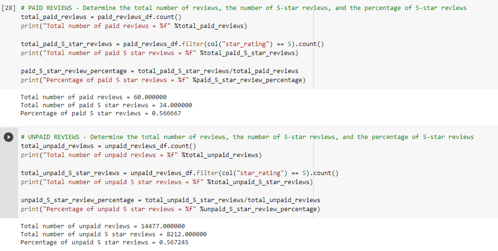
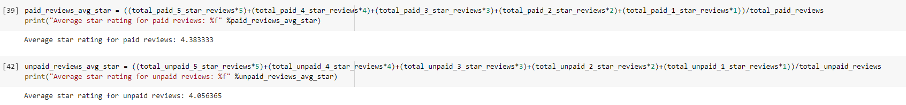

# Amazon Reviews Analysis
The Amazon Vine program is a service that allows manufacturers and publishers to receive reviews for their products. Companies pay a small fee to Amazon and provide products to Amazon Vine members, who are then required to publish a review.

In this project, we had access to approximately 50 datasets. Each one contains reviews of a specific product, from clothing apparel to wireless products. I picked **musical instruments** dataset from [https://s3.amazonaws.com/amazon-reviews-pds/tsv/amazon_reviews_us_Musical_Instruments_v1_00.tsv.gz](https://s3.amazonaws.com/amazon-reviews-pds/tsv/amazon_reviews_us_Musical_Instruments_v1_00.tsv.gz) and used PySpark to perform the ETL process to extract the dataset, transform the data, connect to an AWS RDS instance, and load the transformed data into pgAdmin. 

Next, I used PySpark to determine if there is any bias toward favorable reviews from Vine members in the selected dataset. 

All the code was written using Google Colab.

## Results: 

For the analysis following steps are taken:
1. Extract the dataset into dataframe.
2. Remove the reviews that have less than 20 reviews from the dataframe.
3. Extract the reviews that have 50% or more helpful votes.
4. For comparing the paid and unpaid reviews, filter on the above dataframe based on vine is Y or N and star rating is 5.

The analysis of dataset for paid and unpaid reviews produced following results:

- ***How many Vine reviews and non-Vine reviews were there?***
   Based on the results there are total of 60 paid vine reviews and 14,477 unpaid reviews.

- ***How many Vine reviews were 5 stars? How many non-Vine reviews were 5 stars?***
     Of the paid reviews there are 34 reviews that have 5-star ratings where as, of the unpaid reviews there are 8,212 5-star reviews.

- ***What percentage of Vine reviews were 5 stars? What percentage of non-Vine reviews were 5 stars?***
    The percentage of 5-star ratings for paid reviews as well as unpaid reviews is 57%. 

## Summary
Since the percentage of 5-star ratings for paid and unpaid reviews is same, it appears that there is no positive bias for reviews in the Vine program as far as Musical Instruments are concerned.
  
However, to ensure that the analysis is correct I also calculated weighted average of ratings for paid and unpaid reviews.  

  
The weighted average rating for paid reviews is 4.38 where as for unpaid reviews it is 4.06. There isn't a huge difference in the average ratings for paid and unpaid reviews. 
  
So, it is safe to state that paid Vine membership doesn't affect the customer reviews for musical instruments.
